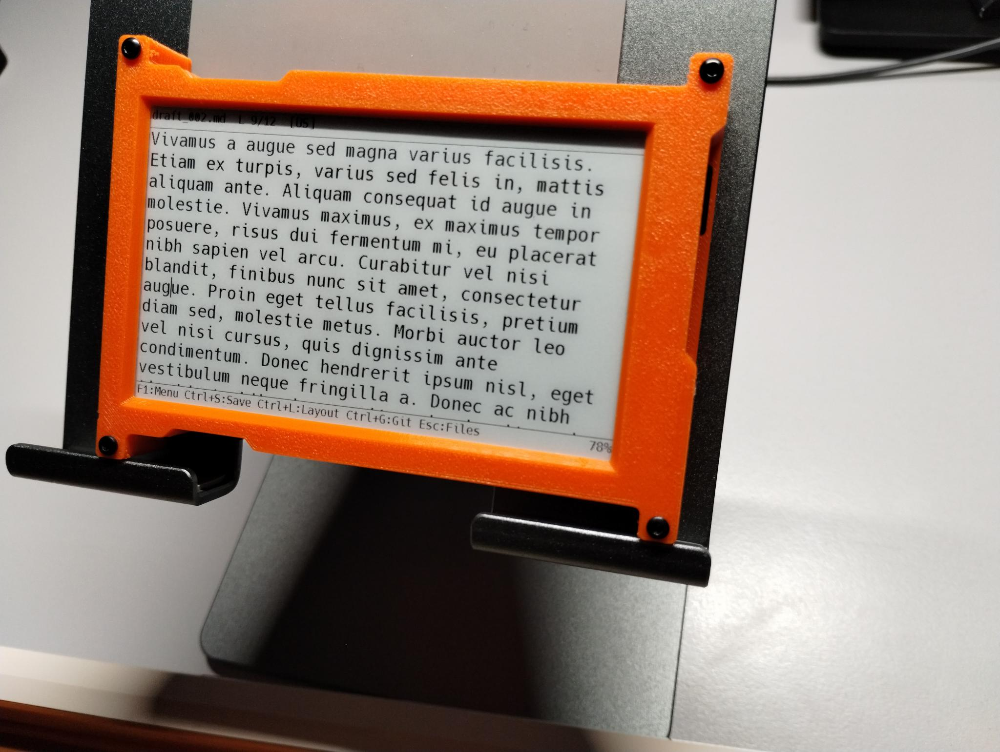
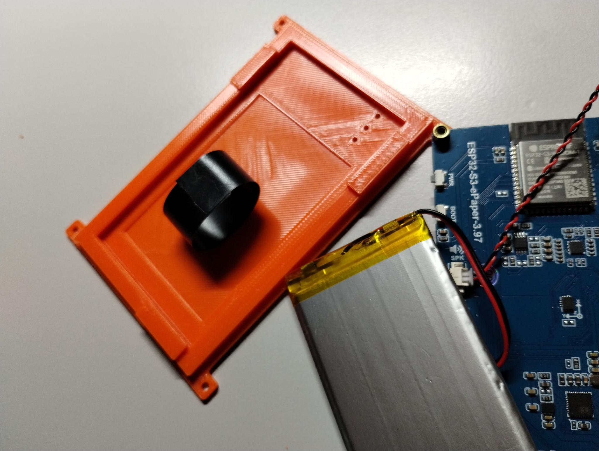
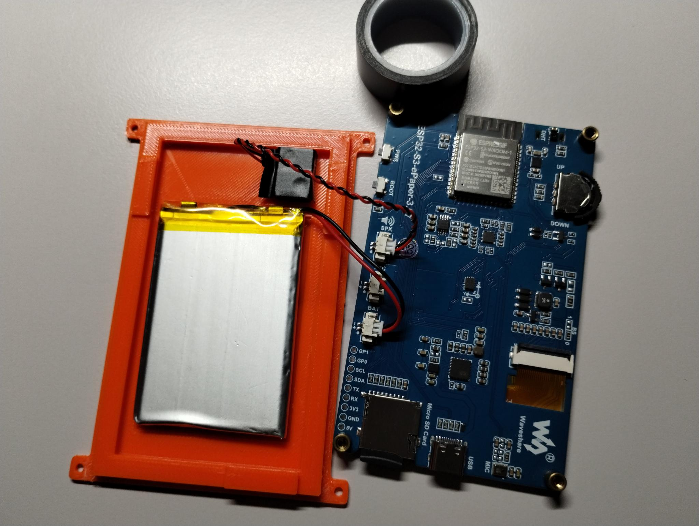
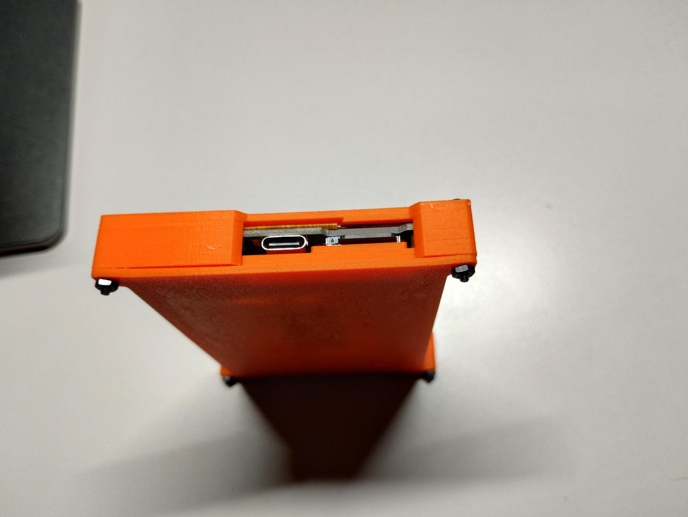
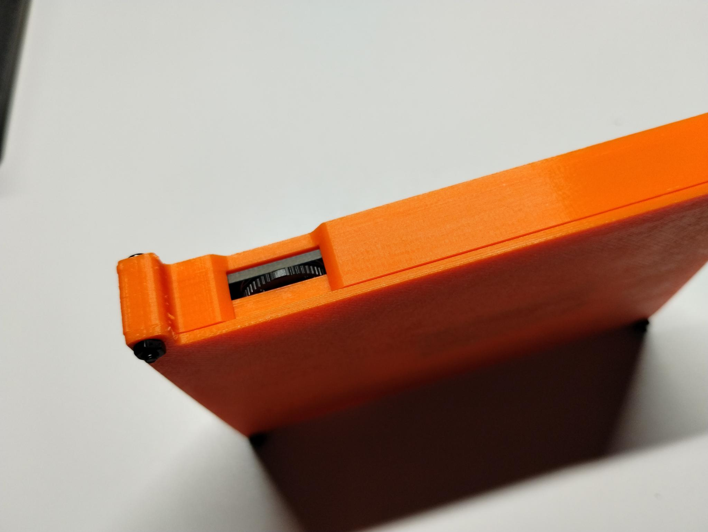
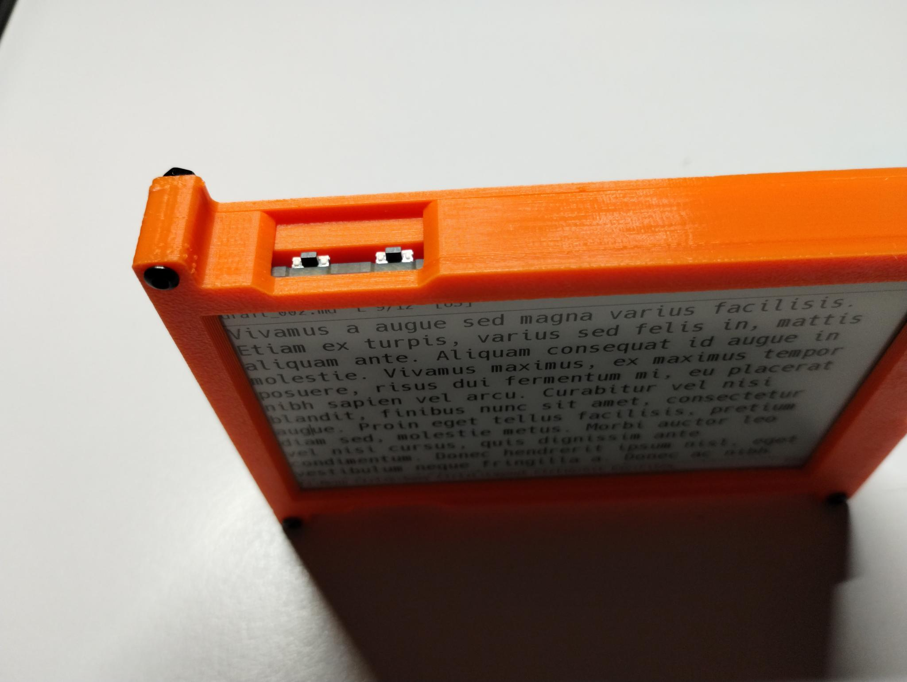

# Enclosure for Waveshare ESP32-S3-ePaper-3.97

[Waveshare
ESP32-S3-ePaper-3.97](https://docs.waveshare.com/ESP32-S3-ePaper-3.97)
is a DIY board with a high definition 3.97" screen.

[Demo video of the
device](https://www.youtube.com/watch?v=QtNKmCt7KFE&list=PLbRMZQ9npKJRDrk0BhtI4gXMBIHM0c_v_).

This enclosure consists of two 3d-printed parts, tied together by four
M2 screws. Inside there's a pocket for the battery that comes with the
board, and a space for the little speaker that is also available in
the set.

Also, a small piece of the packaging foam that comes with the board
can be put inside to minimize the vibrations.

Assembled enclosure:

A ring of insulation tape to hold the battery in its pocket:

The speaker has a self-adhesive surface that sticks it to the
enclosure. A piece of insulation tape covers the metal part to avoid
any shorting:

USB-C socket and the Micro-SD card slot:

The 3-way rocker:

PWR and Boot buttons:

Part list:

* M2*16mm screws: 4 pc
* M2 nuts: 4 pc
* insulation tape
* a piece of packaging foam

Printed parts: PLA, 0.2mm, 20% infill.

Also, [available on Printables](https://www.printables.com/model/1843475-enclosure-for-waveshare-esp32-s3-epaper-397)