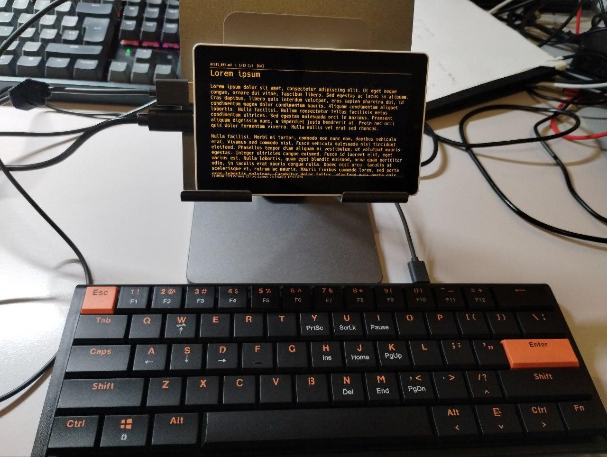

# Draftling

This is a project aiming to build a writerdeck that can use [a variety
of pre-made or DIY hardware](HARDWARE.md). The minimalist GUI lets you
edit Markdown files in a distraction-free manner.

A few [demo
videos](https://youtube.com/playlist?list=PLbRMZQ9npKJRDrk0BhtI4gXMBIHM0c_v_)
are available on my YouTube channel.

An M5Stack Tab5 with AJAZZ NKL61 keyboard and my messy working desk:


## Features

- **WYSIWYG Markdown editing** on monochrome or color LCD display or e-paper

- **Works with any Bluetooth Low Energy (BLE) keyboard**. M5Stack Tab5
  supports also a wired USB keyboard.

- **File browser** to open and manage `.md` files on the SD card
  (entries sorted alphabetically, directories first)

- **Markdown rendering**: headings (H1-H4), bullet and numbered lists,
  blockquotes, code fences, horizontal rules, inline bold / italic /
  code / strikethrough

- **Support for large files** PSRAM on the ESP32 MCU is efficiently
  utilized to allow multi-megabyte file editing.

- **Split screen editing**: You can split the screen in two equal
  halves, or 1/3 and 2/3 parts, and use a second file for side notes
  or comments. Draftling supports also editing thge same file in both
  windows.

- **Synchronizing your files with a Github repository** via GitHub
  REST API. The WiFi client and Git credentials need to be configured
  in `wifi.cfg` and `git.cfg` on your SD card. Both publuc and private
  repositories are supported.

- **Per-file metadata saved**: when a `.md` file is closed (or
  before the device enters deep sleep), the editor records the current
  cursor position and scroll line in a hidden sidecar file named
  `.<basename>.meta` next to the document (for example `notes.md` ->
  `.notes.md.meta`). The next time the file is opened, the cursor is
  restored to its previous position and the view scrolls so the cursor
  is visible. The `.meta` files are hidden from the file browser (they
  start with a dot) and are ignored by Git sync (which only handles
  `*.md`).

- **Color themes** On color LCD boards the editor offers a
  runtime-selectable color theme (F1 -> Settings -> Color theme):
  light green on black (default), dark green on black, amber/orange on
  black, white on black, or black on beige.


## Keyboard Shortcuts

| Shortcut | Action |
|----------|--------|
| F1 | Open main menu (BLE, WiFi, Git, Layout, Settings...) |
| Arrow keys | Move cursor |
| Home / End | Start / end of line |
| PgUp / PgDn | Scroll by page |
| Ctrl+S | Save file |
| Ctrl+O | Open file browser |
| Ctrl+N | New file |
| Ctrl+L | Cycle keyboard layout |
| Win+Space | Cycle keyboard layout (same as Ctrl+L) |
| Ctrl+M | Menu (same as F1) |
| Ctrl+G | Git sync (pull + push) |
| Ctrl+W | Toggle WiFi (connect / disconnect) |
| Ctrl+F | Find |
| Ctrl+H | Find + Replace (Tab switches field, Enter = next match, Ctrl+Enter = replace + next) |
| Ctrl+C / Ctrl+X / Ctrl+V | Copy / Cut / Paste the current selection |
| Ctrl+A | Select all |
| Ctrl+R | Force full e-paper refresh (clears ghosting; e-paper boards only) |
| Ctrl+B | Cycle backlight / front-light brightness (boards with a controllable backlight) |
| Ctrl+Home/End | Start / end of document |
| Ctrl+Left/Right | Word movement |
| Ctrl+1 | Single-pane mode (full-width editor) |
| Ctrl+2 | Split screen into two equal-width panes |
| Ctrl+3 | Split with the left pane at 2/3 width; press again to toggle the left pane to 1/3 |
| Ctrl+Tab | Move keyboard focus to the other pane (when split) |
| Escape | Switch to file browser. With unsaved changes, a dialog offers Save and exit / Exit without saving / Cancel (Up/Down + Enter to choose) |


## Pairing a New Keyboard

If you want to pair a different keyboard (or re-pair after a factory reset
of the keyboard), you need to erase the stored BLE bond first.  There are
three ways to trigger **Forget All Keyboards**:

- **Wakeup / boot button -- 2-second hold**: on every board that has a
  wakeup or boot button (GPIO18 on the Waveshare RLCD-4.2, GPIO0 on most
  others), hold the button for at least 2 seconds.  The device immediately
  drops the current connection, clears all stored pairings, and starts
  scanning for a new keyboard.
- **Side key on LilyGO T5 E-Paper S3 Pro H752 -- 2-second hold**: the side
  key on GPIO48 normally injects F1 (menu) on a short press.  Holding it
  for 2 seconds triggers Forget All instead.
- **"Forget KB" button on the BLE-prompt screen** (boards with a
  touchscreen): when the device is waiting for a keyboard to connect, the
  BLE-prompt screen shows a small **Forget KB** button to the left of the
  **Off** button.  Tapping it has the same effect as the 2-second hold.

After triggering any of these actions the device starts scanning
immediately; connect your new keyboard and it will pair automatically.


## Split-screen Editing

The editor can show two documents side by side. **Ctrl+2** divides the
screen into two equal-width vertical panes; **Ctrl+3** makes the left
pane wider (2/3 of the width) and a second **Ctrl+3** flips the left
pane to 1/3. **Ctrl+1** returns to a single full-width pane.

Each pane opens a file for itself: while split, **Ctrl+O** opens the
file browser for the focused pane, so the picked file loads into that
pane while the other pane keeps its document. **Ctrl+Tab** moves
keyboard focus between the two panes; the focused pane shows the active
cursor and receives all editing keys.

Opening the same file in both panes shares a single in-memory copy of
the document (the panes are two views of the same buffer), so you can
edit or read two parts of one file at once and edits in one pane are
reflected in the other. The current split layout is remembered across
reboot and deep sleep.


## Touch Operations

On boards with a touchscreen, touch input works alongside the
Bluetooth keyboard -- you can use either, or both. All gestures are
summarized below.


### In the editor

| Gesture | Action |
|---------|--------|
| Single tap | Move the cursor to the tapped position |
| Double tap | Select the word at the tapped position |
| Drag up / down | Scroll the document line by line, following the finger (one line per line-height of travel) |
| Swipe up / down (fast flick) | Scroll by roughly one screen |

A drag that moves more than a few pixels never moves the caret -- the
tap-to-cursor action only fires for short, stationary taps.

On the e-paper PaperS3 the gestures are the same, but the slower
refresh rate (~80-150 ms per partial update, several seconds for a
full refresh) means the visible response to a drag is less smooth
than on the color-LCD JC3248W535.

### In menus and the file browser

| Gesture | Action |
|---------|--------|
| Tap a row | Highlight that row (same as moving with arrow keys) |
| Tap the highlighted row again | Activate it (same as pressing Enter) |

This two-step "highlight then activate" flow mirrors the keyboard
"arrows + Enter" interaction and avoids accidental activations on
imprecise taps.


### Wake from sleep

Depending on the hardware, the device wakes up from deep sleep on a
boot or power button, or on touchscreen tap where hardware allows it.


## Keyboard Layouts

The editor supports five keyboard layouts that can be switched with
**Ctrl+L** (or **Win+Space**) or through the **F1 menu**:

| Code | Layout |
|------|--------|
| US | US-English (QWERTY) |
| UA | Ukrainian (Cyrillic) |
| DE | German (QWERTZ with umlauts) |
| FR | French (AZERTY with accents) |
| HE | Hebrew (Israeli standard) |

The current layout is shown in the title bar. By default, only
US-English and Ukrainian are compiled into the firmware. Other layouts
need to be enabled in firmware configuration.


## Configuration Files

Place these on the SD card root:

### WiFi (`wifi.cfg`)

The file consists of two text lines: the SSID and the password.

```
MySSID
MyPassword
```

### Git Sync (`git.cfg`)

The file consists of several key=value lines, providing access to a
Github repository (private or public). The `token` is a GitHub
Personal Access Token with `repo` scope.  **Keep this file private.**

```
repo_url=https://github.com/user/repo
branch=main
token=ghp_xxxxxxxxxxxx
path=docs/
```

## Building the firmware

The project supports a number of ESP32 devices. Some of them are
ready-made and equipped with a battery, while others need a custom
enclosure.

See [HARDWARE.md](HARDWARE.md) for the full list of supported
hardware. See [BUILDING.md](BUILDIgNG.md) for firmware compilation
insttucctions.


## Use of LLM

Most of the code has been generated by Claude AI under my thorough
supervision. As this is a non-commercial and open source project, the
author would never find enough time to program it by hand.

If anyone finds any copyright infringement in the source code, the
original authors are welcome to contact me and negotiate a satisfying
solution.


## Acknowledgements

The firmware utilizes
[Greybeard](https://github.com/flowchartsman/greybeard) and
[Hack](https://github.com/source-foundry/Hack) fonts, both available
under MIT license.


## License

This project is licensed under the MIT License. See [LICENSE](LICENSE) for
details.

Copyright (c) 2026 clackups@gmail.com

Fediverse: [@clackups@social.noleron.com](https://social.noleron.com/@clackups)
