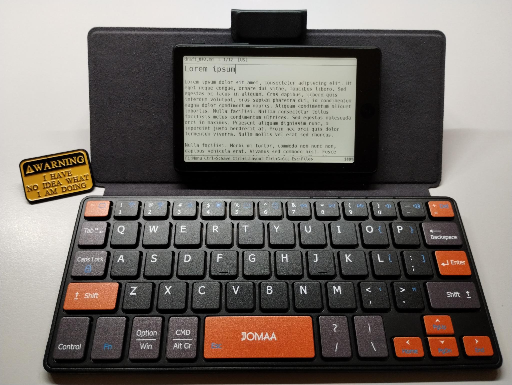

# Draftling

This is a project aiming to build a writerdeck that can use a variety
of pre-made or DIY hardware. The minimalist GUI lets you edit Markdown
files in a distraction-free manner.

A few [demo
videos](https://youtube.com/playlist?list=PLbRMZQ9npKJRDrk0BhtI4gXMBIHM0c_v_)
and [images](images/) demonstrate the firmware use.

Xteink X4 Pro running Draftling firmware:



## Supported hardware

[HARDWARE.md](HARDWARE.md) provides a detailed list of all supported
hardware types.

The [web flasher](https://clackups.github.io/draftling/) allows you to
load the firmware quickly without having to compile it.

* Ready-made consumer grade hardware
  * Xteink X4 Pro (**unlocked devices only!**), so far the best value for money amongst e-paper devices.
  * Xteink X4 Classic (**unlocked devices only!**) -- the buttons-only, no-front-light X4 (untested on physical hardware).
  * LilyGO T5 E-Paper S3 Pro / Pro Lite
  * M5Stack PaperS3 (discontinued)
  * M5Stack PaperMono / PaperMono-Lite (experimental, untested on physical hardware)
  * Waveshare ESP32-S3-Touch-LCD-3.49
  * Seeed Studio reTerminal E1001 (7.5" e-paper)
  * M5Stack Tab5 (no web flasher support, as internal firmware needs an upgrade too)

* DIY boards
  * Waveshare ESP32-S3-ePaper-3.97 ([a 3D-printed enclosure available](3D_Prints/Waveshare_ESP32-S3-ePaper-3.97/))
  * Waveshare ESP32-S3-RLCD-4.2 ([a 3D-printed enclosure available](3D_Prints/Waveshare_ESP32-S3-RLCD-4.2/))
  * Elecrow CrowPanel ESP32-S3 5.79" E-Paper HMI Display
  * Guition JC3248W535
  * 7" and 4.3" Sunton boards
  * 2.8" and 4" Freenove boards
  * Waveshare ESP32-S3-Touch-LCD-7 


## Features

- **WYSIWYG Markdown editing** on monochrome or color LCD display or e-paper

- **Works with any Bluetooth Low Energy (BLE) keyboard**. M5Stack Tab5
  supports also a wired USB keyboard.

- **Fountain screenplays**: `.fountain` files open in a screenplay
  mode that formats scenes, characters, dialogue and transitions as you
  type. See [Writing screenplays](#writing-screenplays-fountain) below.

- **Plain text**: `.txt` files open with no formatting at all -- the
  text is shown and edited exactly as typed.

- **File browser** to open, create and rename `.md`, `.fountain` and
  `.txt` files on the SD card
  (entries sorted alphabetically, directories first)

- **Markdown rendering**: headings (H1-H4), bullet and numbered lists,
  blockquotes, code fences, horizontal rules, inline **bold**,
  *italic*, `code` and ~~strikethrough~~ are displayed styled, with
  the markup characters hidden. The line holding the cursor keeps its
  markup visible so it can be edited.

- **Support for large files** PSRAM on the ESP32 MCU is efficiently
  utilized to allow multi-megabyte file editing.

- **Split screen editing**: You can split the screen in two equal
  halves, or 1/3 and 2/3 parts, and use a second file for side notes
  or comments. Draftling supports also editing thge same file in both
  windows. The split follows the display's long side -- left/right in
  landscape, top/bottom in portrait.

- **Portrait or landscape**: F1 -> Settings -> "Display orientation"
  turns the whole UI 90 degrees. Takes effect after a restart.

- **Synchronizing your files with a Git repository** using a real,
  built-in Git client that speaks the standard smart-HTTP protocol
  (`git-upload-pack` / `git-receive-pack`). A full commit history is
  kept locally in `.git/` on the SD card. Each sync commits your
  local edits, fetches the remote branch, fast-forwards or rebases
  your commits on top of it, performs a three-way merge (conflicts
  are committed as-is with `<<<<<<<` / `=======` / `>>>>>>>` markers),
  writes the result back to the SD card and pushes to the server. The
  WiFi client and Git credentials are configured in `wifi.cfg` and
  `git.cfg` on the SD card -- or, for WiFi, picked from an on-device
  scan (F1 -> WiFi: New connection), which writes `wifi.cfg` for you. Public
  and private repositories on GitHub and other standard Git HTTP hosts
  are supported. See [docs/git-sync.md](docs/git-sync.md).

- **Per-file metadata saved**: when a `.md` file is closed (or
  before the device enters deep sleep), the editor records the current
  cursor position and scroll line in a hidden sidecar file named
  `.<basename>.meta` next to the document (for example `notes.md` ->
  `.notes.md.meta`). The next time the file is opened, the cursor is
  restored to its previous position and the view scrolls so the cursor
  is visible. The `.meta` files are hidden from the file browser (they
  start with a dot) and are ignored by Git sync (which only commits
  `*.md`, `*.fountain` and `*.txt` files).

- **Color themes** On color LCD boards the editor offers a
  runtime-selectable color theme (F1 -> Settings -> Color theme):
  light green on black (default), dark green on black, amber/orange on
  black, white on black, or black on beige.

- **SD card via USB** On boards whose USB port wires the ESP32-S3's
  native USB controller straight to the connector (Xteink X4 Pro /
  Classic, LilyGO T5 E-Paper S3 Pro / Pro Lite / H752, M5Stack
  PaperS3 and PaperMono, Waveshare ESP32-S3-ePaper-3.97, ESP32-S3-RLCD-4.2,
  ESP32-S3-Touch-LCD-7 and ESP32-S3-Touch-LCD-3.49, and all three
  Freenove FNK0104 boards), F1 -> "SD card via USB" opens a picker
  for Off / Read-only / Read-write; the choice applies as soon as you
  leave that picker (Enter to confirm, or Esc to back out unchanged),
  exposing the SD card to a connected computer as a normal USB
  mass-storage drive without removing the card. While it is on,
  editing, creating files, and Git sync are all refused; switching
  between Read-only and Read-write reconnects the
  USB drive so the computer picks up the new permission, and it
  switches itself back off if no computer has been connected for 5
  minutes. Turning it back off restarts the device -- these boards'
  USB port doubles as the flashing/console interface, and a restart
  is the reliable way to hand it back from this feature's USB mode,
  the same as pressing the physical reset button.


## Keyboard Shortcuts

| Shortcut | Action |
|----------|--------|
| F1 | Open main menu (BLE, WiFi, Git, Layout, Settings...) |
| Arrow keys | Move cursor |
| Home / End | Start / end of line |
| PgUp / PgDn | Scroll by page |
| Ctrl+Up/Down | Scroll by page (same as PgUp/PgDn) |
| Ctrl+S | Save file |
| Ctrl+O | Open file browser |
| Ctrl+N | New file (asks for the format: Markdown, Fountain or plain text) |
| Ctrl+L | Cycle keyboard layout |
| Win+Space | Cycle keyboard layout (same as Ctrl+L) |
| Ctrl+M | Menu (same as F1) |
| Ctrl+P | Enter deep sleep. With unsaved changes, a dialog offers Save and sleep / Sleep without saving / Cancel |
| Ctrl+G | Git sync (commit, fetch, rebase/merge, push) |
| Ctrl+W | Toggle WiFi (connect / disconnect) |
| Ctrl+F | Find |
| Ctrl+H | Find + Replace (Tab switches field, Enter = next match, Ctrl+Enter = replace + next) |
| Ctrl+C / Ctrl+X / Ctrl+V | Copy / Cut / Paste the current selection |
| Ctrl+A | Select all |
| Ctrl+R | Force full e-paper refresh (clears ghosting; e-paper boards only) |
| Ctrl+B | Cycle backlight / front-light brightness (boards with a controllable backlight) |
| Ctrl+Home/End | Start / end of document |
| Ctrl+Left/Right | Word movement |
| Ctrl+1 | Single-pane mode (full editor) |
| Ctrl+2 | Split into two equal panes (left/right in landscape, top/bottom in portrait) |
| Ctrl+3 | Split with the first pane at 2/3; press again to toggle the first pane to 1/3 |
| Ctrl+Tab | Move keyboard focus to the other pane (when split) |
| Escape | Switch to file browser. With unsaved changes, a dialog offers Save and exit / Exit without saving / Cancel (Up/Down + Enter to choose) |

`Ctrl+P` and `Ctrl+1` / `Ctrl+2` / `Ctrl+3` also work in the file
browser (the split layout applies the next time you open a file).

In the file browser:

| Shortcut | Action |
|----------|--------|
| Up / Down, Enter | Select and open a file |
| N or Ctrl+N | New file: pick Markdown (`.md`), Fountain screenplay (`.fountain`) or plain text (`.txt`) with Up/Down + Enter, or press M / F / T |
| Alt+R | Rename the selected file. The name must end in `.md`, `.fountain` or `.txt`; the saved cursor position (the `.meta` file) moves with it, and changing the extension changes the format |
| F1 / Ctrl+M | Menu |


## Writing screenplays (Fountain)

Besides Markdown, Draftling edits screenplays in the plain-text
[Fountain](https://fountain.io/syntax/) format. A file whose name ends
in `.fountain` opens in Fountain mode; `Ctrl+N` (or `N` in the file
browser) followed by "Fountain screenplay" starts a new, untitled
screenplay, and `Ctrl+S` then offers a `draft_NNN.fountain` name.
Saving under a `.md` or `.txt` name switches the document to Markdown
or plain text. In split mode each pane keeps its own
format, so a screenplay can sit next to Markdown notes.

As in the Slugline editor, the screenplay is formatted as you type,
following the Fountain rules:

- **Scene headings** -- a line starting with `INT.`, `EXT.`, `EST.`,
  `INT./EXT.` or `I/E` after a blank line -- are bold. Force one with a
  leading `.`.
- **Character** names -- an all-uppercase line after a blank line,
  optionally with an extension such as `(V.O.)` -- are indented, and
  the lines below them are laid out as **dialogue** and
  **parentheticals** until the next blank line. Force a mixed-case name
  with `@`; a trailing `^` marks dual dialogue.
- **Transitions** (an uppercase line ending in `TO:`, or forced with
  `>`) are flush right; `>centered text<` is centered.
- `*italic*`, `**bold**`, `***bold italic***` and `_underline_` are
  drawn styled; `~lyrics` and `= synopses` are italic; `#` sections
  look like headings; `===` is a page break; `[[notes]]` are boxed and
  `/* boneyard */` text is struck through.
- A title page (`Title:`, `Credit:`, `Author:`, ... at the top of the
  file) shows its keys in bold.

Markers such as the forcing characters are hidden except on the line
holding the cursor. Two editing helpers are available:

- **Enter** at the end of a scene heading or transition also inserts
  the blank line that must follow it (Shift+Enter inserts a single
  newline).
- **Tab** completes names used in the script: on an empty line it
  offers character names, starting with the one who spoke before the
  last speaker; on a partly typed line (e.g. `br` or `int`) it offers
  matching character names, scene headings and transitions. Press Tab
  again for the next suggestion.


## Sleep

The device enters deep sleep automatically after the inactivity timeout
(F1 -> Settings -> "Standby timeout"), and you can put it to sleep on
demand with **Ctrl+P** or the **F1 -> "Sleep now"** menu entry. Wake
with the boot / power button, or a touchscreen tap on boards that
support it.

An automatic (timeout) sleep always saves any unsaved changes first. A
sleep you trigger yourself asks what to do when the open document has
unsaved changes -- **Save and sleep**, **Sleep without saving** (the
edits are dropped), or **Cancel**.


## Pairing a New Keyboard

If you want to pair a different keyboard (or re-pair after a factory reset
of the keyboard), you need to erase the stored BLE bond first.  There are
three ways to trigger **Forget All Keyboards**:

- **Wakeup / boot button -- 2-second hold**: on every board that has a
  wakeup or boot button (GPIO18 on the Waveshare RLCD-4.2, GPIO0 on most
  others), hold the button for at least 2 seconds.  The device immediately
  drops the current connection, clears all stored pairings, and starts
  scanning for a new keyboard.
- **Side key on LilyGO T5 E-Paper S3 Pro H752 -- 2-second hold**: the side
  key on GPIO48 normally injects F1 (menu) on a short press.  Holding it
  for 2 seconds triggers Forget All instead.
- **"Forget KB" button on the BLE-prompt screen** (boards with a
  touchscreen): when the device is waiting for a keyboard to connect, the
  BLE-prompt screen shows a small **Forget KB** button to the left of the
  **Off** button.  Tapping it has the same effect as the 2-second hold.

After triggering any of these actions the device starts scanning
immediately; connect your new keyboard and it will pair automatically.


## Split-screen Editing

The editor can show two documents at once. **Ctrl+2** divides the
screen into two equal panes; **Ctrl+3** makes the first pane bigger
(2/3) and a second **Ctrl+3** flips it to 1/3. **Ctrl+1** returns to a
single pane.

The split always divides the display's **long side**: in landscape you
get left / right panes, in portrait (F1 -> Settings -> "Display
orientation") you get top / bottom panes. "First pane" is the left one
in landscape, the top one in portrait.

Each pane opens a file for itself: while split, **Ctrl+O** opens the
file browser for the focused pane, so the picked file loads into that
pane while the other pane keeps its document. **Ctrl+Tab** moves
keyboard focus between the two panes; the focused pane shows the active
cursor and receives all editing keys.

Opening the same file in both panes shares a single in-memory copy of
the document (the panes are two views of the same buffer), so you can
edit or read two parts of one file at once and edits in one pane are
reflected in the other. The current split layout is remembered across
reboot and deep sleep.


## Touch Operations

On boards with a touchscreen, touch input works alongside the
Bluetooth keyboard -- you can use either, or both. All gestures are
summarized below.


### In the editor

| Gesture | Action |
|---------|--------|
| Single tap | Move the cursor to the tapped position |
| Double tap | Select the word at the tapped position |
| Drag up / down | Scroll the document line by line, following the finger (one line per line-height of travel) |
| Swipe up / down (fast flick) | Scroll by roughly one screen |

A drag that moves more than a few pixels never moves the caret -- the
tap-to-cursor action only fires for short, stationary taps.

On the e-paper PaperS3 the gestures are the same, but the slower
refresh rate (~80-150 ms per partial update, several seconds for a
full refresh) means the visible response to a drag is less smooth
than on the color-LCD JC3248W535.

### In menus and the file browser

| Gesture | Action |
|---------|--------|
| Tap a row | Highlight that row (same as moving with arrow keys) |
| Tap the highlighted row again | Activate it (same as pressing Enter) |

This two-step "highlight then activate" flow mirrors the keyboard
"arrows + Enter" interaction and avoids accidental activations on
imprecise taps.


### Wake from sleep

Depending on the hardware, the device wakes up from deep sleep on a
boot or power button, or on touchscreen tap where hardware allows it.


## Keyboard Layouts

The editor supports five keyboard layouts that can be switched with
**Ctrl+L** (or **Win+Space**) or through the **F1 menu**:

| Code | Layout |
|------|--------|
| US | US-English (QWERTY) |
| UA | Ukrainian (Cyrillic) |
| DE | German (QWERTZ with umlauts) |
| FR | French (AZERTY with accents) |
| HE | Hebrew (Israeli standard) |

The current layout is shown in the title bar. By default, only
US-English and Ukrainian are compiled into the firmware. Other layouts
need to be enabled in firmware configuration.


## Configuration Files

Place these on the SD card root:

### WiFi (`wifi.cfg`)

The file consists of two text lines: the SSID and the password.

```
MySSID
MyPassword
```

You do not have to edit this file by hand: F1 -> "WiFi: New
connection..." scans for visible networks, lets you pick one and (if
it is not open) type its password, then writes `wifi.cfg` for you on a
successful connection. Editing the file directly still works too --
F1 -> "WiFi: Connect to <SSID>" and `Ctrl+W` (quick reconnect, no
scan) read it fresh on every call, so a hand-edited file always takes
effect on the next connect.

### Git Sync (`git.cfg`)

The file consists of several `key=value` lines. `repo_url` and `token`
are required; everything else is optional. The `token` is used as the
HTTP Basic password -- on GitHub this is a Personal Access Token (a
classic token needs `repo` scope; a fine-grained token needs
read/write "Contents" permission). **Keep this file private.**

```
repo_url=https://github.com/user/repo
branch=main
token=ghp_xxxxxxxxxxxx
path=notes/
username=x-access-token
author_name=Jane Doe
author_email=jane@example.com
```

| Key | Required | Meaning |
|-----|----------|---------|
| `repo_url` | yes | Repository URL. A trailing `.git` is optional. |
| `token` | yes | HTTP Basic password / access token. |
| `branch` | no | Branch to sync (default `main`). |
| `path` | no | Sync into this sub-directory of the repo instead of its root. |
| `username` | no | HTTP Basic user (default `x-access-token`, which works for GitHub). |
| `author_name` / `author_email` | no | Identity stamped on commits Draftling creates. |

The full protocol, history layout and conflict behaviour are described
in [docs/git-sync.md](docs/git-sync.md).

## Building the firmware

The project supports a number of ESP32 devices. Some of them are
ready-made and equipped with a battery, while others need a custom
enclosure.

See [HARDWARE.md](HARDWARE.md) for the full list of supported
hardware. See [BUILDING.md](BUILDIgNG.md) for firmware compilation
insttucctions.


## Use of LLM

Most of the code has been generated by Claude AI under my thorough
supervision. As this is a non-commercial and open source project, the
author would never find enough time to program it by hand.

If anyone finds any copyright infringement in the source code, the
original authors are welcome to contact me and negotiate a satisfying
solution.


## Acknowledgements

The firmware utilizes
[Greybeard](https://github.com/flowchartsman/greybeard) and
[Hack](https://github.com/source-foundry/Hack) fonts, both available
under MIT license.


## License

This project is licensed under the MIT License. See [LICENSE](LICENSE) for
details.

Copyright (c) 2026 clackups@gmail.com

Fediverse: [@clackups@social.noleron.com](https://social.noleron.com/@clackups)
